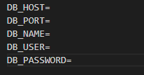

# Teste SoftExpert


# Descrição

> #
> ## Projeto Backend - Sistem de produtos para um mercado em PHP
>
>Descrição: O projeto é um sistema de backend em PHP para gerenciar produtos e vendas. Ele permite o cadastro de produtos, tipos de produtos e valores percentuais de imposto para cada tipo. A tela de venda permite registrar os produtos adquiridos e suas quantidades, calculando o valor total de cada item e o valor do imposto pago. O sistema também apresenta totalizadores para o valor da compra e o valor dos impostos. As vendas são salvas para registro e os dados são armazenados em um banco de dados.
>
> ## Projeto Frontend - Lista de Veículos em Angular
> Descrição: O projeto consiste em um frontend desenvolvido em React que se integra a um sistema de backend em PHP para gerenciar produtos e vendas. O frontend permite o cadastro de produtos, tipos de produtos e valores percentuais de imposto. Também oferece uma tela de venda onde é possível registrar produtos adquiridos, calcular valores e impostos, e exibir totalizadores. As transações são enviadas ao backend para serem armazenadas no banco de dados. O frontend é responsivo e oferece uma experiência intuitiva aos usuários.
>
> ### Empresa: SoftExpert
>#
>
> ## Tecnologias utilizadas no projeto:
>  - `Back-end` : PHP
>  - `Front-end` : React
>  - `Banco de dados` : Postgresql
>#

# Instalação do projeto

> - Este projeto foi construido com PHP, é necessário te-lo instalado em sua máquina previamente.

 ## Passo 1
   Após clonar o projeto em sua máquina navegue até o diretório raiz do projeto:
```bash
  cd SoftExpert-test
```

 ## Passo 2
   Execute o seguinte comando para renomear seu arquivo .env:
```bash
  cp .env.example .env
```

 ## Passo 3
   Preencha o arquivo .env com dos dados de seu banco Postgresql:


 ## Passo 4
   Execute o seguinte comando para criar a api key:
```bash
  php config/GenerateApiKey.php
```

 ## Passo 5
   Execute o seguinte comando para criar as tabelas no banco de dados:
```bash
  php database/Migrations.php
```

 ## Passo 6
   Em seguida, popule as tabelas com dados iniciais:
```bash
  php database/Seed.php
```

 ## Passo 7
   Execute o servidor do php em sua máquina:
```bash
  php -S localhost:8080  
```
#
<br>
 
<h3 align="center">Import o arquivo de rotas em seu postman, o arquivo se encontra na raiz do projeto com o nome: "routes-collection.json"</h3>
